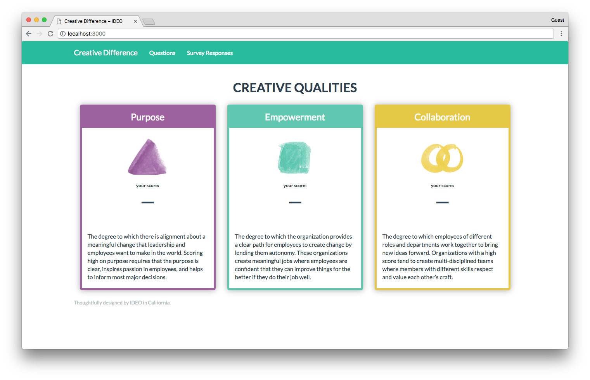
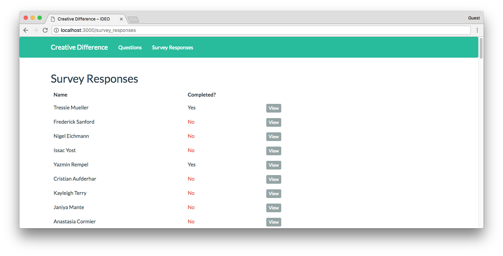
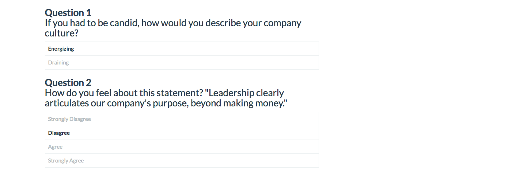
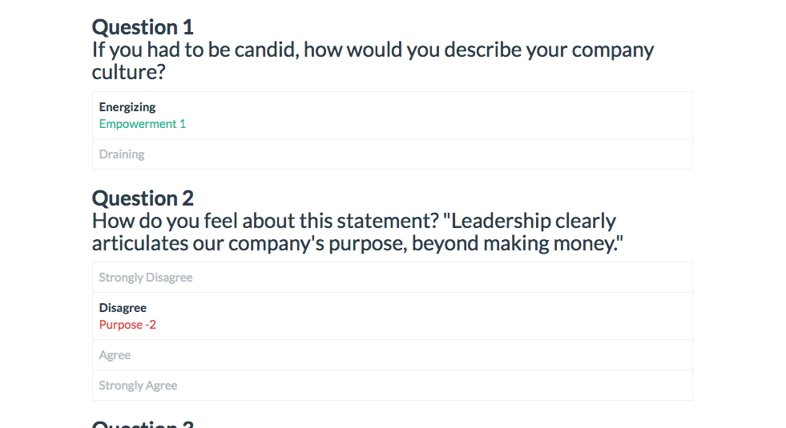
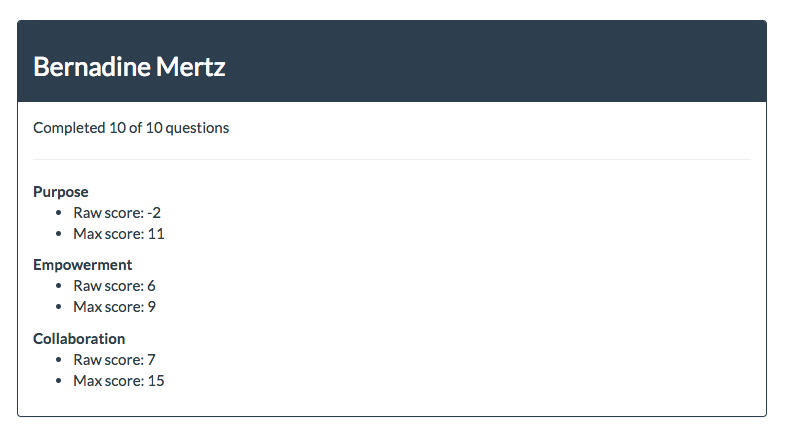
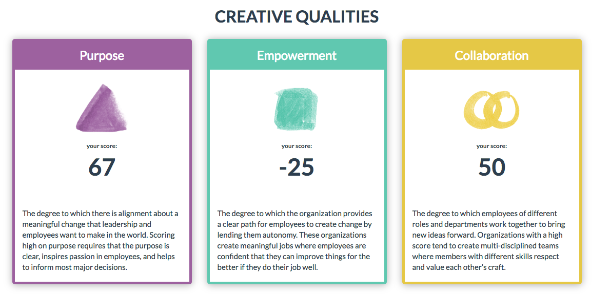

# IDEO Creative Difference Rails Challenge

Hello! Welcome to the [IDEO Creative Difference](https://creativedifference.ideo.com) Rails challenge.

This challenge will test your ability to write clean, intuitive, and well-tested Ruby, HTML, CSS and Javascript – all things we care about deeply at IDEO!

## Choose which part to do

Please choose one of the two parts that can show off your strongest skillset(s):

**Part 1: Rails - build new back-end features and tests (~ 1 hour)**

**Part 2: React + CSS - build new React components and style them (~ 1 hour)**

First, you'll need to set up the Rails environment, detailed below in [Environment Setup](#environment-setup).

Then, once you're done with the part you have chosen, please [head down to the reflection and submission in Part 3](#part-3-reflection-and-submission).

Good luck!

## Introduction

This challenge contains an example Rails app with some pre-existing code and tests.

Your task will be to take the app in this repo and add new behavior to it!

## Environment Setup

Start by cloning this repository:

```bash
$ git clone git@github.com:ideo/c-delta-challenge.git
```

Ensure that you have installed:

* [Ruby](https://www.ruby-lang.org/en/downloads/) 2.4.3 (use rbenv or RVM to ensure the right version, or else alter the settings in `.ruby-version` and `Gemfile` to match your local version)
* [Yarn](https://yarnpkg.com/lang/en/docs/install/)
* [Bundler](https://bundler.io/) (run `gem install bundler` once ruby is installed)

Install the project's dependencies:

```bash
$ cd c-delta-challenge
$ bundle install
$ yarn install
```

Confirm that Rails works!

```bash
$ rails --version
Rails 5.1.6
```

Now set up your database:

```bash
$ rails db:migrate
$ rails db:seed
$ rails db:test:prepare
```

We've included a test suite written using [RSpec](http://rspec.info/). Run it and ensure that all tests pass!

```bash
$ rspec spec/

...


Finished in 0.43062 seconds (files took 1.29 seconds to load)
22 examples, 0 failures
```

Finally, run the Rails server and load the page at `http://localhost:3000`

```bash
$ rails s
=> Booting Puma
=> Rails 5.1.6 application starting in development on http://localhost:3000

...
```

​:tada: :clap: :tada:

You're ready to start!

## A Quick Walkthrough

Our demo app is a (very!) pared down version of our [Creative Difference](http://creativedifference.ideo.com) product, which helps organizations assess the different qualities that help make companies innovative. We achieve this by surveying hundreds (or thousands) of employees across the organization and scoring their survey responses based on a rubric.

Based on the survey responses, the company gets a score for each Creative Quality which we help them measure and take action to improve.

If you run the Rails server, the home page shows a very basic dashboard with three creative qualities: **Purpose**, **Empowerment**, and **Collaboration**.



If you head over to the **Questions** tab, you can see the questions that make up this sample survey.


Drilling down into a question lets you see the different answer choices and how each choice impacts the score of the Creative Quality it corresponds to:


In this example, an answer of "Energizing" gives a 1 score for the **Purpose** creative quality. We have simplified the implementation in this app, but in our production app, many questions have choices that impact more than one quality.

Our seeds file creates 100 survey responses -- click the **Survey Responses** tab to see all of them.



A survey response is "completed" if all of the 10 questions have been answered.

Drilling down into a survey response lets you see how the respondent answered each question (their answer is in **bold**):



That's the tour! Let's start the challenge.

# The Challenge

The challenge will take you through a few steps that include scoring survey responses, styling and creating a dashboard of final results that will look like this:


**_If you're skipping to Part 2, please [head on down there](#part-2-displaying-the-results)._**

## Part 1: Scoring SurveyResponses

When viewing a question, you'll notice that each choice affects a particular Creative Quality either positively or negatively.


This means that if a respondent chooses "Draining," the score for "Purpose" is decreased by 1.

### 1.1: Scoring Creative Qualities for a single answer to a question

Update the `response#show` page to show how each survey response's answer impacts Creative Quality scores, as follows:



If a score is impacted positively, color it in green. If it's impacted negatively, color it red (you can use [Bootstrap](http://getbootstrap.com/docs/3.3/) for this).

When you're done, write a commit. If your code changes the behavior of any models, make sure that behavior is tested!

### 1.2: Scoring Creative Qualities for an entire survey response

Next, we're diving into some complexity. Let's display the Creative Quality score for the entire survey response at the top of the page:



We score each Creative Quality for a survey response by adding up the raw score for all of the answers where someone chose a choice associated with that creative quality, and divide that by the maximum possible positive score for that quality.

In more detail:

* The **raw score** is the sum of all of the question choice scores for that creative quality, for an individual survey response.
  * **Example:** If I select four question choices that impact the **Purpose** quality with the scores 3, 3, 2, and -1, then my raw score for Purpose would be `3 + 3 + 2 - 1 = 7`.
* The **max score** is the highest possible score a respondent could've gotten for a quality, if they were to answer all the questions. It is a static value for everyone, because anyone could _potentially_ answer all of the questions. A question could have multiple choices that link to the same quality (it does in our production survey), so please use the constraint that someone could only choose one choice per question when calculating the max.

Please update the survey response page to show the raw and max for each quality.

Write another commit when you're done (and yep –– test any behavior changes to models!).

### 1.3 Scoring Creative Qualities globally

At this point you've completed scoring for individual survey responses as well as for entire survey response sets.

Now let's compute the final scores across all survey responses so that we can display them on the front page, like this:



The **normalized score** (ie: **Collaboration: 73**) is the final score that we display per quality, and should be between -100 and 100.

* The formula is: `(total_raw_for_quality / total_max_for_quality) * 100`
* Step 1: Add up the raw and max scores for this quality across all survey responses.
* Step 2: Divide the raw by the max and multiply it by 100 (_we also clamp the value if > 100 or < -100_).
* **Example:** If across all survey responses, the total raw score for Collaboration is 240 and the max is 575, then the normalized score would be `(240 / 575) * 100 = 42`). Round to the nearest integer, and clamp the value if it ends up outside the -100 to 100 bounds.

Your tasks:

* Compute the normalized score for each Creative Quality.
* Display each Creative Quality's normalized score on the index page.

:star: Make a commit of your work! :star:

**_If you're skipping Part 2, please [head on down to the reflection](#part-3-reflection-and-submission)._**

## Part 2: Displaying the Results

The home page lists three of the six Creative Qualities we see as essential to innovation within an organization. In this part, we're going to restyle the results, and then rewrite the view of the page to use React (v16) instead of Rails + ERB.

### Part 2.1: Using React to display the Creative Qualities

In order to make the application more dynamic and interactive, we'd like to start using React (v16) to power the index page.

The site is already setup to use the [webpacker](https://github.com/rails/webpacker) gem and [React](https://5abc31d8be40f1556f06c4be--reactjs.netlify.com/docs/hello-world.html), and you'll find a basic `App.js` React component already provided for you in the `/app/javascript/components` directory.

There is also an **API endpoint** where you can retrieve the creative quality data: `http://localhost:3000/creative_qualities.json`

The Rails template is currently making use of the stylesheet in `qualities.scss`, which you can reference as you create your React components.

Your tasks:

* Use the API endpoint above to load the creative quality data into your React application. We have included [react-refetch](https://github.com/heroku/react-refetch) in `package.json` but feel free to use any package you like for fetching data.
* Replace the Rails + ERB code in `index.html.erb` by implementing the provided React `App.js` and creating React components to render the creative qualities.
* Replace the styling provided in `qualities.scss` with a CSS-in-JS solution so that the styling is more tightly coupled with the React components. We have included [styled-components](https://www.styled-components.com/) with a very simple example in `App.js`, but feel free to use any package you like.

:star: Great! Please make a `git commit` of your work for this part. :star:

### Part 2.2: Adding dynamic sort and displaying scores


Now that the creative qualities are displayed in React, we'd like to add some other UI features.

Your tasks:

* Implement a "read more" link on each description, so that the text is truncated to 120 characters. Clicking "read more" should display the whole description and toggle into a "read less" link.
* Add two sorting buttons at the top right-hand corner of the page:
  * **Sort by score** should sort the Creative Quality cards by score.
  * **Sort by name** should sort the Creative Quality cards alphabetically by the name.
  * Clicking a button multiple times should toggle the sorting, e.g. low to high score, and then high to low score.

* Implement the progress bar as shown in the screenshot above, using the `score` field from the creative quality. Note that scores range from -100 to 100, so the middle point of the bar (i.e. an "empty" bar) should represent a score of 0, negative scores should extend to the left, and positive scores should extend to the right, as shown above.

:star: Nice! Please make a `git commit` of your work for this part. :star:

### Part 2.3: Jest Unit Tests

You'll find a unit test supplied for `App.js` that utilizes [Jest](https://jestjs.io/en/) and [Enzyme](https://airbnb.io/enzyme/) in `/__tests__/components/App.unit.test.js` and you can run the tests with:

```
yarn test
```

or to watch files for changes and automatically re-run tests:

```
yarn test --watch
```

Your task:

* For every component that you've added, add an appropriate new unit test file in the `/__tests__/` directory tree. The component's basic functionality should be tested (e.g. that it can shallow render, like in our unit test example).


:star: You're all done! Make a final commit of your work! :star:


## Part 3: Reflection and Submission

That's a wrap!

To submit your challenge, please **send us an email at c-delta-challenge@ideo.com** with the following:

### Reflection

Tell us what you thought of this coding challenge. What did you like? What did you not like?

### Code Improvements

If you had more time, are there any pieces of code (ours or yours) that you'd improve? How so and why?

### A link to your code on Github!

Create a private or public Github repo with your challenge and send us the link!

**Please do not fork this repo, as it will be publicly viewable for all other candidates.**

## Thanks!

Hope you enjoyed this challenge – we really appreciate you making the time!

– The IDEO Products Team
